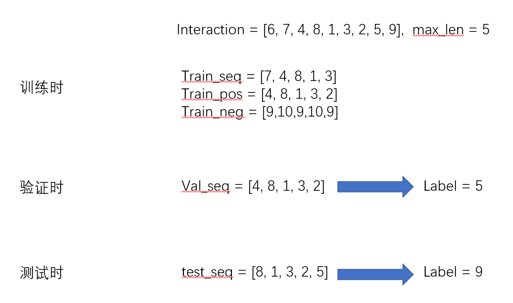
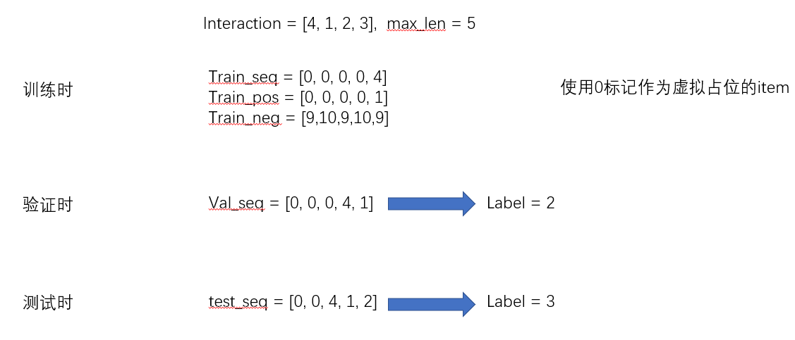

复现了SASREC算法，同时与MF算法比较。

* 与论文实验不同的是，原论文实验仅仅采样了若干规模的user和item进行测试，此程序实现了对全部user和item的测试评估。

* 原论文实验每一次采样batch都要重新生成训练数据，是很耗时间的，此程序预先把训练序列，验证序列，测试序列都计算好保存下来，以供训练时采样数据。

**执行步骤**

0. 编译内嵌的cpp文件(初始时运行一次就好，下次运行不需要再编译)

   ```shell
   python setup.py build_ext --inplace
   ```

1. 运行模型

```
python run_sas.py
```

```
python run_mf.py
```


**实验结果**

|      | pre@10 | recall@10 | ndcg@10 |
| :--: | :----: | :-------: | :-----: |
|  MF  | 0.63%  |   6.39%   |  3.02%  |
| SAS  | 1.16%  |  11.63%   |  5.85%  |


**一些细节**

序列处理，因为用户的历史记录的长度各不相同，因为我们要把历史交互记录都保存在矩阵中，所以长度要对齐。所以历史记录的统一长度取决于最长的记录长度，同时考虑到有些用户的历史记录长度会非常大，可能造成内存不足，所以需要设置历史记录的统一长度的最大可取值**max_len**。序列处理可以分成两种情况

1. 序列长度大于max_len



  2.序列长度小于max_len

 

[参考](https://github.com/pmixer/SASRec.pytorch)

